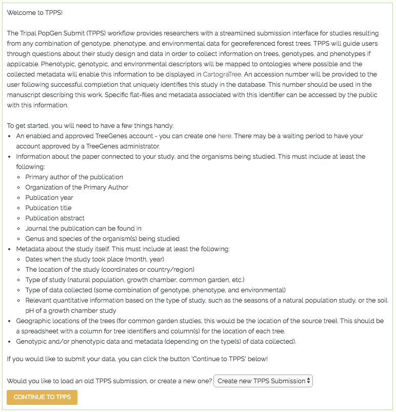

*****************
Login and Profile
*****************

Users can only access the TPPS form while they are logged into their Tripal account. This is so that a user can pick up where they left off, should they need to make their submission over multiple sessions. For example, if a user is submitting data through TPPS, then realizes that they need to collect some additional information before completing their submission, they can leave the TreeGenes site to collect their additional information, and when they return, all of the data that user entered previously will be stored on TreeGenes, and the user will not need to fill out all of the form fields again.

Checking if the user is logged in, loading relevant submissions, and redirecting or displaying the correct form is handled in the following snippet::

    function tpps_master($form, &$form_state){

        global $user;
        $params = drupal_get_query_parameters();

        if (!isset($user->mail) and !isset($form_state['stage'])){
            //first access, not logged in
            $form_state['stage'] = 'frontpage';

            front_create_form($form, $form_state);

            drupal_add_js(drupal_get_path('module', 'tpps') . "/tpps.js");

            return $form;
        }
        elseif (!isset($user->mail)){
            //not first access, but not logged in
            $destination = drupal_get_destination();
            drupal_goto('user/login', array('query' => $destination));
        }
        elseif (isset($params['accession']) and !isset($form_state['stage'])) {
            //logged in, and with accession number in link
            $old_form_state = variable_get('tpps_incomplete_' . $user->mail . $params['accession']);
            $form_state['saved_values'] = $old_form_state['saved_values'];
            $form_state['stage'] = $old_form_state['stage'];
            $form_state['accession'] = $old_form_state['accession'];
            $form_state['dbxref_id'] = $old_form_state['dbxref_id'];
        }
        else {
            //logged in, with plain link
            if (!isset($form_state['stage'])){
                //first access
                $form_state['stage'] = 'frontpage';

                front_create_form($form, $form_state);

                drupal_add_js(drupal_get_path('module', 'tpps') . "/tpps.js");

                return $form;
            }
            else {
                //not first access
                if (!isset($form_state['saved_values']['frontpage']['accession']) or (isset($form_state['saved_values']['frontpage']['accession']) and $form_state['saved_values']['frontpage']['accession'] === 'new')){
                    //no submissions, or selected to create new submission
                    tpps_init_project($form, $form_state);
                    variable_set('tpps_incomplete_' . $user->mail . $form_state['saved_values']['frontpage']['accession'], $form_state);
                }
                $old_form_state = variable_get('tpps_incomplete_' . $user->mail . $form_state['saved_values']['frontpage']['accession']);
                $form_state['saved_values'] = $old_form_state['saved_values'];
                $form_state['stage'] = $old_form_state['stage'];
                $form_state['accession'] = $old_form_state['accession'];
                $form_state['dbxref_id'] = $old_form_state['dbxref_id'];
            }
        }
    
    //$form_state was loaded from saved variable, continue defining the form based on $form_state
    ...
    }

If the user is not logged in, they are redirected to the login page, where they can login as an existing user or sign up to create a new account.

If the user is logged in, and they have any incomplete TPPS Submissions, they will be given the option to continue with one of their old submissions, or create a new TPPS Submission.

A screenshot of the landing page for a logged in user with a submission in progress can be seen below

