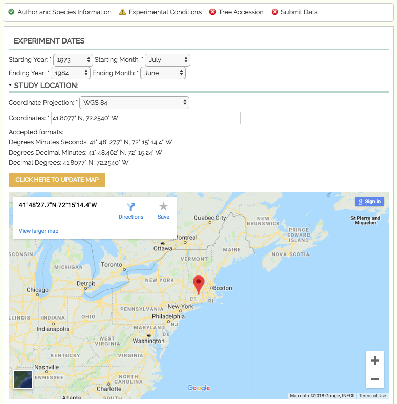

************
Study Design
************

The second set of fields in TPPS is the Study Design section, where users upload metadata about their experiment. The form fields and their properties are as follows:

* Study Start Date: ``fieldset``

  * Start Date Year: ``select`` - options '1970' to '2018'
  * Start Date Month: ``select`` - options 'January' through 'December'

* Study End Date: ``fieldset``

  * End Date Year: ``select`` - options '1970' to '2018'
  * End Date Month: ``select`` - options 'January' through 'December'

* Study Location: ``fieldset``

  * Coordinate Projection: ``select`` - options 'WGS 84', 'NAD 83', 'ETRS 89', 'Custom Location (street address)'
  * Coordinates: ``textfield`` - only visible if the user selects 'WGS 84', 'NAD 83', or 'ETRS 89' from 'Coordinate Projection'
  * Custom Location: ``textfield`` - only visible if the user selects 'Custom Location' from 'Coordinate Projection'
  * Map Thumbnail: Google Maps iframe that allows the user to visually validate the location they have provided

* Data Type: ``select`` - options 'Genotype', 'Genotype x Phenotype', 'Genotype x Environment', 'Genotype x Phenotype x Environment', 'Phenotype x Environment'
* Study Type: ``select`` - options 'Natural Population (Landscape)', 'Growth Chamber', 'Greenhouse', 'Experimental/Common Garden', 'Plantation'

Natural Population
==================

* Natural Population: ``fieldset`` - only visible if the user selects 'Natural Population' from 'Study Type'

  * Season: ``checkboxes`` -  options 'Spring', 'Summer', 'Fall', 'Winter'
  * Assessions: ``select`` - options '1' to '30'

Growth Chamber
==============

* Growth Chamber: ``fieldset`` - only visible if the user selects 'Growth Chamber' from 'Study Type'

  * CO2 Info: ``fieldset``

     * CO2 Control: ``select`` - options 'controlled', 'uncontrolled'
     * CO2 Value: ``textfield``

  * Humidity Info: ``fieldset``

     * Humidity Control: ``select`` - options 'controlled', 'uncontrolled'
     * Humidity Value: ``textfield``

  * Light Intensity Info: ``fieldset``

     * Light Intensity Control: ``select`` - options 'controlled', 'uncontrolled'
     * Light Intensity Value: ``textfield``

  * Temperature Info: ``fieldset``

     * Average High Temperature: ``textfield``
     * Average Low Temperature: ``textfield``

  * Rooting Info: ``fieldset``

     * Rooting Type: ``select`` - options 'Aeroponics', 'Hydroponics', and 'Soil'
     * Soil: ``fieldset`` - only visible if the user selects 'Soil' from 'Rooting Type'

         * Soil Type: ``select`` - options 'Sand', 'Peat', 'Clay', 'Mixed', 'Other'
         * Custom Soil Type: ``textfield`` - only visible if the user selects 'Other' from 'Soil Type'
         * Soil Container Type: ``textfield``

     * PH: ``fieldset``

         * PH Control: ``select`` - options 'controlled', 'uncontrolled'
         * PH Value: ``textfield``

     * Treatments: ``checkboxes`` -  options 'Seasonal Environment', 'Air temperature regime', 'Soil Temperature regime', 'Antibiotic regime', 'Chemical administration', 'Disease status', 'Fertilizer regime', 'Fungicide regime', 'Gaseous regime', 'Gravity Growth hormone regime', 'Mechanical treatment', 'Mineral nutrient regime', 'Humidity regime', 'Non-mineral nutrient regime', 'Radiation (light, UV-B, X-ray) regime', 'Rainfall regime', 'Salt regime', 'Watering regime', 'Water temperature regime', 'Pesticide regime', 'pH regime', 'other perturbation'
     * Treatments Description: ``textfield`` - if an option from 'Treatments' is selected, users must provide a description of the treatment

Greenhouse
==========

* Greenhouse: ``fieldset`` - only visible if the user selects 'Greenhouse' from 'Study Type'

  * Humidity Info: ``fieldset``

     * Humidity Control: ``select`` - options 'controlled', 'uncontrolled'
     * Humidity Value: ``textfield`` - only visible if the user selects 'controlled' from 'Humidity Control'

  * Light Intensity Info: ``fieldset``

     * Light Intensity Control: ``select`` - options 'controlled', 'uncontrolled'
     * Light Intensity Value: ``textfield`` - only visible if the user selects 'controlled' from 'Light Intensity Control'

  * Temperature Info: ``fieldset``

     * Average High Temperature: ``textfield``
     * Average Low Temperature: ``textfield``

  * Rooting Info: ``fieldset``

     * Soil: ``fieldset``

        * Soil Type: ``select`` - options 'Sand', 'Peat', 'Clay', 'Mixed', 'Other'
        * Custom Soil Type: ``textfield`` - only visible if the user selects 'Other' from 'Soil Type'
        * Soil Container Type: ``textfield``

     * PH: ``fieldset``

        * PH Control: ``select`` - options 'controlled', 'uncontrolled'
        * PH Value: ``textfield`` - only visible if the user selects 'controlled' from 'PH Control'

     * Treatments: ``checkboxes`` - options 'Seasonal Environment', 'Air temperature regime', 'Soil Temperature regime', 'Antibiotic regime', 'Chemical administration', 'Disease status', 'Fertilizer regime', 'Fungicide regime', 'Gaseous regime', 'Gravity Growth hormone regime', 'Mechanical treatment', 'Mineral nutrient regime', 'Humidity regime', 'Non-mineral nutrient regime', 'Radiation (light, UV-B, X-ray) regime', 'Rainfall regime', 'Salt regime', 'Watering regime', 'Water temperature regime', 'Pesticide regime', 'pH regime', 'other perturbation'
     * Treatments Description: ``textfield`` - if an option from 'Treatments' is selected, users must provide a description of the treatment

Common Garden
=============

* Common Garden: ``fieldset`` - only visible if the user selects 'Experimental/Common Garden' from 'Study Type'

  * Irrigation: ``fieldset``

     * Irrigation Type: ``select`` - options 'Irrigation from top', 'Irrigation from bottom', 'Drip Irrigation', 'Other', 'No Irrigation'
     * Custom Irrigation Type: ``textfield`` - only visible if the user selects 'Other' from 'Irrigation Type'

  * Salinity Info: ``fieldset``

     * Salinity Control: ``select`` - options 'controlled', 'uncontrolled'
     * Salinity Value: ``textfield``

  * Biotic Environment Info: ``fieldset``

     * Biotic Environment Type: ``select`` - options 'Herbivores', 'Mutilists', 'Pathogens', 'Endophyts', 'Other', 'None'
     * Custom Biotic Environment Type: ``textfield`` - only visible if the user selects 'Other' from 'Biotic Environment Type'

  * Season: ``checkboxes`` - options 'Spring', 'Summer', 'Fall', 'Winter'
  * Treatments: ``checkboxes`` - options 'Seasonal environment', 'Antibiotic regime', 'Chemical administration', 'Disease status', 'Fertilizer regime', 'Fungicide regime', 'Gaseous regime', 'Gravity Growth hormone regime', 'Herbicide regime', 'Mechanical treatment', 'Mineral nutrient regime', 'Non-mineral nutrient regime', 'Salt regime', 'Watering regime', 'Pesticide regime', 'pH regime', 'Other perturbation'
  * Treatments Description: ``textfield`` - if an option from 'Treatments' is selected, users must provide a description of the treatment

Plantation
==========

* Plantation: ``fieldset`` - only visible if the user selects 'Plantation' from 'Study Type'

  * Season: ``checkboxes`` - options 'Spring', 'Summer', 'Fall', 'Winter'
  * Assessions: ``textfield``
  * Treatments: ``checkboxes`` - options 'Seasonal environment', 'Antibiotic regime', 'Chemical administration', 'Disease status', 'Fertilizer regime', 'Fungicide regime', 'Gaseous regime', 'Gravity Growth hormone regime', 'Herbicide regime', 'Mechanical treatment', 'Mineral nutrient regime', 'Non-mineral nutrient regime', 'Salt regime', 'Watering regime', 'Pesticide regime', 'pH regime', 'Other perturbation'
  * Treatments Description: ``textfield`` - if an option from 'Treatments' is selected, users must provide a description of the treatment

