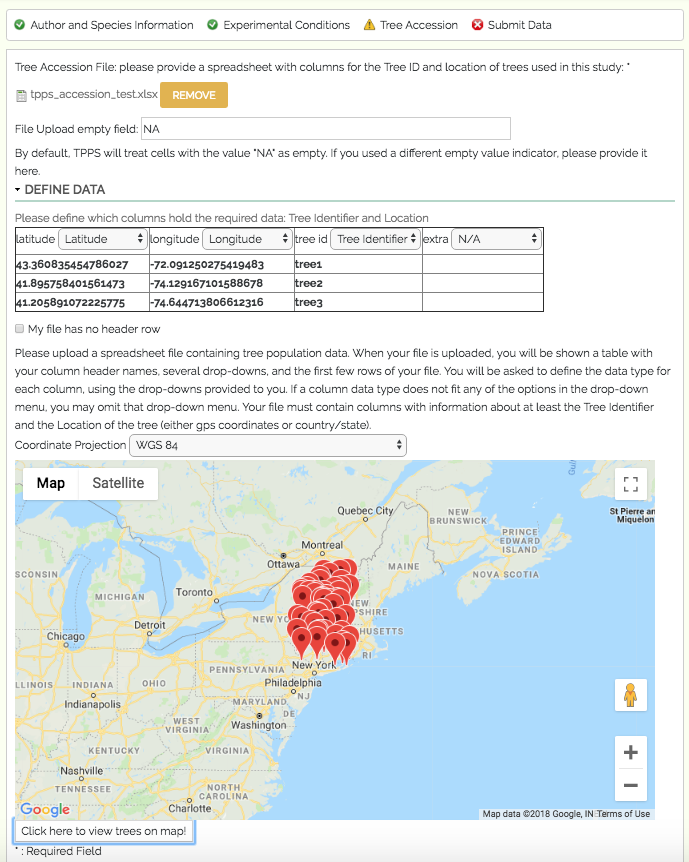

**************
Tree Accession
**************

The third set of fields in TPPS is the Tree Accession section, where users upload information about where trees are located. The form fields and their properties are as follows:

* Tree Accession: ``fieldset`` - only visible if number of species in `Publication and Species Interface`_ is 1, or if the 'Separate Tree Accession' checkbox is unchecked.

  * Tree Accession File: ``managed_file`` - spreadsheet of tree locations
  * Tree Accession Columns: ``fieldset`` of ``select`` elements - user will define which of their columns contain the Tree ID, and which of their columns contain location information. If the number of species is >1, user will also define which of their columns contain the genus and species of each tree.
  * Coordinate Projection: ``select`` - options 'WGS 84', 'NAD 83', 'ETRS 89'. Only visible if 'Latitude' or 'Longitude' columns are selected in 'Tree Accession Columns'
  * Map Thumbnail: Google Maps iframe that allows the user to visually validate the tree locations they have provided

* Separate Tree Accession: ``checkbox``
* Separate Tree Accession Information: ``fieldset`` - only visible if the 'Separate Tree Accession' checkbox is checked

  * Tree Accession File **x**: ``managed_file`` - spreadsheet of tree locations of tree species **x**
  * Tree Accession Columns **x**: ``fieldset`` of ``select`` elements - user will define which of their columns contain the Tree ID, and which of their columns contain location information

.. _`Publication and Species Interface`: page_1.html

