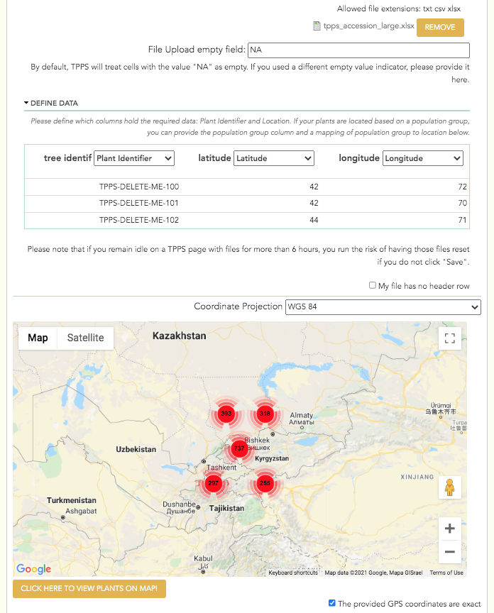

***************
Plant Accession
***************

The third set of fields in TPPS is the Plant Accession section, where users upload information about where plants are located. The form fields and their properties are as follows:

* Plant Accession: ``fieldset`` - only visible if number of species in `Publication and Species Interface`_ is 1, or if the 'Separate Plant Accession' checkbox is unchecked.

  * Plant Accession File: ``managed_file`` - spreadsheet of plant locations
  * Plant Accession Columns: ``fieldset`` of ``select`` elements - user will define which of their columns contain the Plant ID, and which of their columns contain location information. If the number of species is >1, user will also define which of their columns contain the genus and species of each plant.
  * Coordinate Projection: ``select`` - options 'WGS 84', 'NAD 83', 'ETRS 89'. Only visible if 'Latitude' or 'Longitude' columns are selected in 'Plant Accession Columns'
  * Map Thumbnail: Google Maps iframe that allows the user to visually validate the plant locations they have provided

* Separate Plant Accession: ``checkbox``
* Separate Plant Accession Information: ``fieldset`` - only visible if the 'Separate Plant Accession' checkbox is checked

  * Plant Accession File **x**: ``managed_file`` - spreadsheet of plant locations of species **x**
  * Plant Accession Columns **x**: ``fieldset`` of ``select`` elements - user will define which of their columns contain the Plant ID, and which of their columns contain location information

.. _`Publication and Species Interface`: page_1.html

