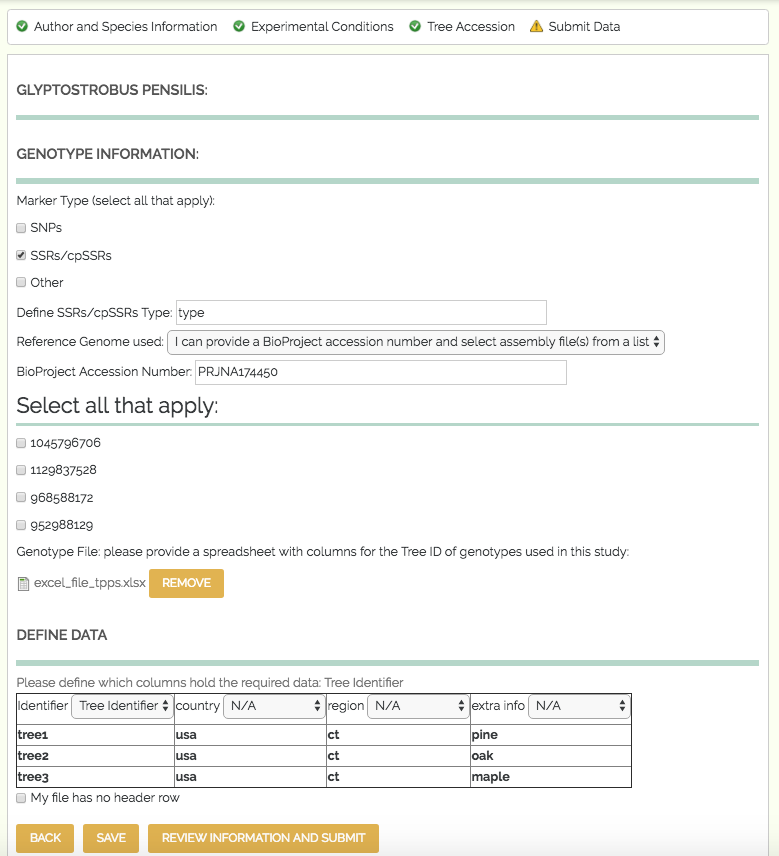

************************************
Genotype, Phenotype, and Environment
************************************

The fourth set of fields in TPPS is the Genotype, Phenotype, and Environment section, where users upload Genotypic, Phenotypic, and Environmental data and metadata. The form fields and their properties are as follows:

* Tree Species **x**: ``fieldset``

Phenotype
=========

  * Phenotype Information: ``fieldset`` - only visible if the user selects 'Genotype x Phenotype', 'Genotype x Phenotype x Environment', or 'Phenotype x Environment' from 'Data Type' in `Study Design`_

     * Phenotype **x**: ``fieldset``

         * Phenotype Name: ``textfield`` - autocomplete options from ``chado.phenotype`` table
         * Phenotype Attribute: ``textfield`` -  autocomplete options from ``chado.phenotype`` table
         * Phenotype Description: ``textarea``
         * Phenotype Units: ``textfield`` - autocomplete options from ``chado.phenotypeprop`` table
         * Phenotype Structure: ``textfield`` - autocomplete options from ``chado.phenotype`` table - only visible if the 'Phenotype **x** has a structure descriptor' checkbox is checked
         * Phenotype Value Range : ``textfield`` - autocomplete options from ``chado.phenotypeprop`` table - only visible if the 'Phenotype **x** has a value range' checkbox is checked

     * Phenotype Metadata file: ``managed_file`` - spreadsheet of metadata about each phenotype - only visible if the 'I would like to upload a phenotype metadata file' checkbox is checked
     * Phenotype Metadata File Columns: ``fieldset`` of ``select`` elements - user will define which of their columns contain the Phenotype Name/Identifier, Phenotype Attribute, Phenotype Description, Phenotype Units, Phenotype Structure, Max/Min Phenotype Values - only visible if the 'I would like to upload a phenotype metadata file' checkbox is checked
     * Phenotype File: ``managed_file`` - spreadsheet of phenotypes
     * Phenotype File Columns: ``fieldset`` of ``select`` elements - user will define which of their columns contain the Tree ID, Phenotype Name/Identifier, and Phenotype value

Genotype
========

  * Genotype Information: ``fieldset`` - only visible if the user selects 'Genotype', 'Genotype x Phenotype', 'Genotype x Environment', or 'Genotype x Phenotype x Environment' from 'Data Type' in `Study Design`_

     * Genotype Marker Type: ``checkboxes`` - options 'SNPs', 'SSRs/cpSSRs', 'Other'
     * Genotype SNPs: ``fieldset`` - only visible if the user selects 'SNPs' from 'Genotype Marker Type'

         * SNPs Genotyping Design: ``select`` - options 'GBS', 'Targeted Capture', 'Whole Genome Resequencing', 'RNS-Seq', 'Genotyping Array'
         * GBS Type: ``select`` - options 'RADSeq', 'ddRAD-Seq', 'NextRAD', 'RAPTURE', 'Other' - only visible if the user selects 'GBS' from 'SNPs Genotyping Design'
         * GBS Custom Type: ``textfield`` - only visible if the user selects 'Other' from 'GBS Type'
         * Targeted Capture Type: ``select`` - options 'Exome Capture', 'Other' - only visible if the user selects 'Targeted Capture' from 'SNPs Genotyping Design'
         * Targeted Capture Custom Type: ``textfield`` - only visible if the user selects 'Other' from 'Targeted Capture Type'

     * Genotype SSRs/cpSSRs Type: ``textfield`` - only visible if the user selects 'SSRs/cpSSRs' from 'Genotype Marker Type'
     * Genotype Other Marker Type: ``textfield`` - only visible if the user selects 'Other' from 'Genotype Marker Type'
     * Reference Genome: ``select`` - stored reference genomes, as well as 'I can provide a URL to the website of my reference file(s)', 'I can provide a GenBank accession number (BioProject, WGS, TSA) and select assembly file(s) from a list', 'I can upload my own reference genome file', 'I can upload my own reference transcriptome file', 'I am unable to provide a reference assembly'
     * BioProject Accession: ``textfield`` - only visible if the user selects 'I can provide a GenBank accession number (BioProject, WGS, TSA) and select assembly file(s) from a list' from 'Reference Genome'

         * NCBI Assembly Accessions: ``checkboxes`` - options pulled directly from NCBI

     * URL to Reference Genome: ``textfield`` - only visible if the user selects 'I can provide a URL to the website of my reference file(s)' from 'Reference Genome'
     * Manual Assembly File: ``managed_file`` - FASTA or Multi-FASTA formatted file - only visible if the user selects 'I can upload my own reference genome file' or 'I can upload my own reference transcriptome file' from 'Reference Genome'
     * Manual Assembly File Columns: ``fieldset`` of ``select`` elements - user will define which of their columns contain the scaffold/chromosome ID
     * Genotype File Type: ``checkboxes`` - options 'Genotype Assay', 'Assay Design', 'VCF'
     * Genotype VCF File: ``managed_file`` - .VCF file of genotypes - only visible if the user selects 'VCF' from 'Genotype File Type'
     * Genotype File: ``managed_file`` - spreadsheet of genotypes - only visible if the user selects 'Genotype Assay' from 'Genotype File Type'
     * Genotype File Columns: ``fieldset`` of ``select`` elements - user will define which of their columns contain the Tree ID
     * Assay Design File: ``managed_file`` - Assay design file - only visible if the user selects 'Assay Design' from 'Genotype File Type'

.. _`Study Design`: page_2.html

