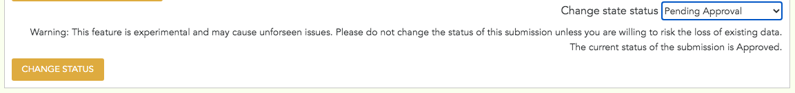
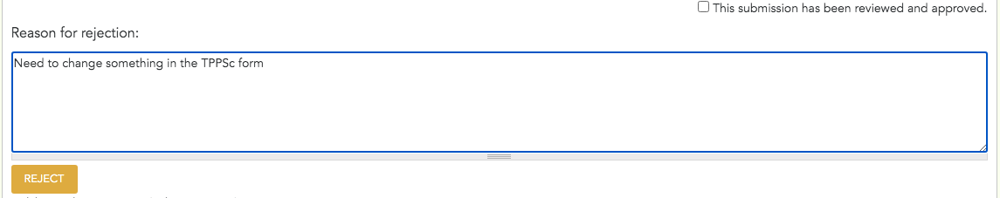

*********************
Submission Management
*********************

Once a submission is completed, it is not available to the public until it has been approved by an administrator. This can be done from the TPPS admin approval panel, which can be accessed in one of two ways:

1. Click the link in the alert sent to the site admin email
2. Navigate to ``http://<site domain>/tpps-admin-panel/<accession number>``

Once you are on the submission approval panel, you can either fill out the rejection reason field and click ``Reject`` to reject the submission, or you can check the ``This submission has been reviewed and approved`` box, and click ``Approve`` to approve it.

If the submission is approved the user will recieve a notification via email, and the data that was not added through file uploads will be added to chado. The remaining data, which was added through file uploads, will be added to chado later during a tripal job. This data can take a long time to add, which is why it is added in a tripal job rather than immediately after approval.

If the submission is rejected, the user will recieve a notification via email, and the submission will move from the ``completed`` state back to an ``incomplete`` submission. That way, the user can see the comments from the administrator, and can make appropriate changes to their submission. 

Managing Submission Tags
========================

One of the newer features of TPPS is the Submission Tagging system. Submission tags appear on the TPPS details page, as well as the TPPS admin panel. The ``TPPS``, ``TPPSc``, and data type tags are all added to submissions automatically. However, you can manually add and remove custom tags for a submission through the TPPS admin panel:

1. Navigate to ``http://<site domain>/tpps-admin-panel/<accession number>#tags``
2. Click the tags in the "Available Tags" section that you would like to add.
3. Click the remove button on tags in the "Current Tags" section that you would like to remove.
4. To create a new tag or change the name or color of an existing tag, click the "Manage TPPS Submission Tags" link.

Tags can be added and removed from submissions regardless of their status, meaning you can manage the tags of submissions anywhere in the submission process, from ``Incomplete`` to ``Approved``.

Changing a Submission State
===========================

Sometimes you may want to go back and change parts of a completed submission. However, if you try to access the TPPS or TPPSc form for a completed submission, you should get an "Access denied" message. To access the form for a completed submission, you must first change the state of the submission back to ``Incomplete``. **Please note:** this process will add the "Under construction" warning to the TPPS details page for the submission. To change the status of the submission back to ``Incomplete``:

1. Navigate to ``http://<site domain>/tpps-admin-panel/<accession number>``
2. Scroll down to the "Change State Status" field.
3. Select "Pending Approval" from the drop-down.

4. Click the "Change Status" button.
5. The page will now reload, and the submission will appear as it normally does when pending approval. Scroll back down to the "Reason for rejection" section and write a note about why you need to go back to the TPPS or TPPSc form for this submission.

6. Click the "Reject" button.
7. You should now be able to access the TPPS or TPPSc form for this submission.
