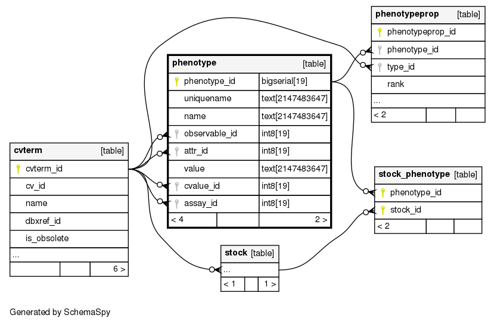
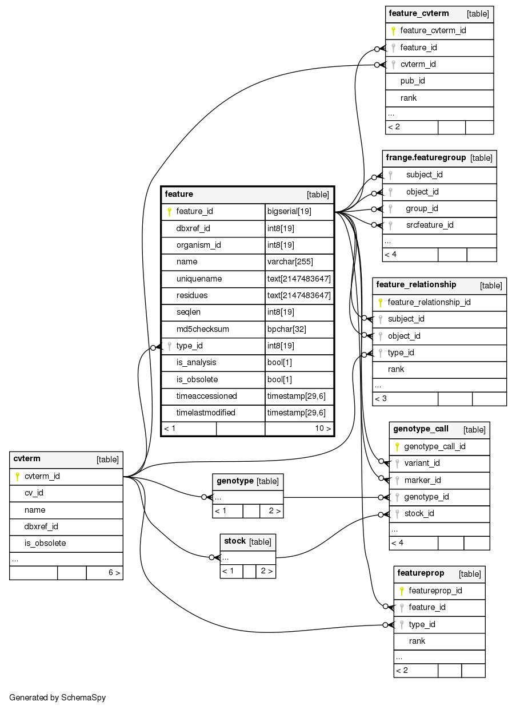

Where Does Data Go?
===================

This section assumes that the reader is familiar with the `Chado`_ relational database schema. It will explain where data is stored and how different data types within the same TPPS submission are associated with one another.

Phenotype
---------

For each phenotype measurement, a ``phenotype`` record is created with a ``uniquename`` with the format ``<Project Accession>-<Plant ID>-<Phenotype Name>``. The ``value`` is the measured value of the phenotype (or ``null`` if value is not applicable). The metadata for the phenotype (unit, description, min/max values, etc) is then represented with associated ``phenotypeprop`` records. The phenotype is associated with the plant through the ``stock_id`` of the base ``phenotype`` record, as well as through the ``stock_phenotype`` table.

Here is a representation of the relationships between some of the phenotype tables for reference:

Genotype
--------

How genotype data gets submitted in TPPS varies slightly based on the type of genotype data and the format it is provided in, but the locations in Chado and the associations between the data stay almost entirely the same. The function that records all of this data can be found `here <https://gitlab.com/TreeGenes/TGDR/-/blob/docs_edits/forms/submit/submit_all.php#L991>`_.

For each genotype marker, two separate ``feature`` records are created, called the ``marker`` and ``variant`` records. In addition to the ``feature`` records, a ``genotype`` record is created. Each genotype call for each individual is represented in the ``genotype_call`` table, which associates the ``marker``, ``variant``, ``genotype``, ``stock``, and ``project`` together and also holds any additional metadata about the call. Each ``stock`` is also associated with each ``genotype`` in the ``stock_genotype`` table.

If association data is available for a genotype marker, then an additional ``feature`` record is created with a ``feature_cvterm`` for the cvterm of the associated trait and a ``featureprop`` for the type of association statistics being used (P-value, Bonferroni, etc). A ``feature_relationship`` record will then be created between the association feature and the ``variant`` feature, and the ``value`` of this record will be the calculated association confidence value.

Here is a representation of the relationships between some of the genotype tables for reference:

.. _Chado: http://gmod.org/wiki/Chado_-_Getting_Started
