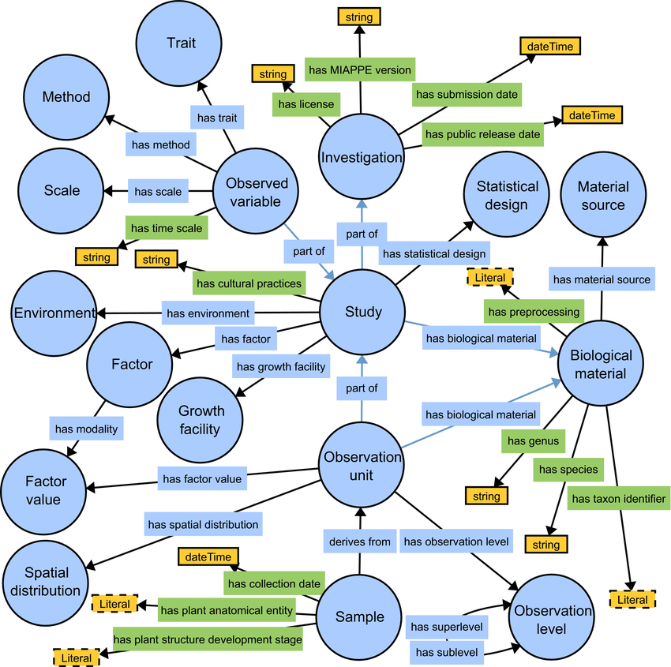

    
---------------------------

The TreeGenes Plant Phenotype Submission (TPPS) system has been updated to support submissions that are compliant with the `MIAPPE`_ (Minimum Information About a Plant Phenotyping Experiment) standard. This document outlines the necessary steps and considerations for preparing and submitting MIAPPE-compliant data through TPPS. A lot of MIAPPE information is based on the `ISA Abstract Model`_ that consists of three core entities: Investigation, Study, Assay.

   
.. note::

    colors in flowchart correspond to requriements

Investigation
~~~~~~~~~~~~~~~~~

Investigations in MIAPPE represent the over-arching pieces of a publication like title, abstract, release and submission dates.

Required: `Title`, `MIAPPE Version`

This entity corresponds directly with TGDRxxxx studies in TPPS. 

.. image:: ../_static/images/
   :alt: Mappings between MIAPPE Investigation and Chado tables

Study
~~~~~~~~~~~~~~~~~

An investigation can have one or more studies. This is to allow for Investigations where experiments are conducted at different institutions and growth facilities with different cultural practices.

Required: `Study ID`, `Study Title`, `Start Date`, `Contact Institution`, `Geographic Location`, `Experiment Site Name`, `Experimental Design description`, `Observation unit description`, `Growth facility description`

Environment
~~~~~~~~~~~~~~~~~

The environmental parameters that are kept constant throughout the experiment and did not change between observation units or assays.

Required: `Study unique ID`, `Environmental parameter`, `Value`

Experimental Factor
~~~~~~~~~~~~~~~~~~~~

The object of a study is to determine the effect of one or more experimental factors on the biological material. Therefore, a factor is something that varies between observational units and may be biotic or abiotic.

Required: `Study unique ID`, `Factor Type`, `Description`, `Values`

Event
~~~~~~~~~~~~~~~~~

An Event record represents a discrete occurence at a given time. This can be when a or part of a factor, or a confounding factor is realized in a given observation unit. 

Required: `Study unique ID`, `Type`, `Date`

Biological Material
~~~~~~~~~~~~~~~~~~~~

This entity captures details about the organism in the experiment, where it was sourced from, and the preprocessing step to get it into the experiment. It is recommended to follow the `MCPD`_ (Multi-Crop Passport Descriptors) guidelines plus a unique identifier provided by the institute when preparing biological material information for submission. This also needs to include fields like genus, species, and infraspecific name alongside geographical coordinates. The biological material also should include pretreatments (to the seeds, tree cuttings) prior to starting the experiment. The proveneance information like, forest wild site, laboratory-specific population and any relevant DOI's to gene banks should also be included. 

Required: `Study unique ID`, `Biological Material ID`

Biological Unit
~~~~~~~~~~~~~~~~~~~~

This entity is meant to represent the different scales, or levels, of an observation and is well described in `Pommier et al.`_. This is intended to provid metadata if what is observed is at the single plant level or across multiple plants at the plot level and the Experimental Factor.

Required: `Study unique ID`, `Biological Material ID`, `Observation Unit`, `Type`

.. important::

   hierarichical levels of observation units are specified at the study level and must coincide with order of key:value pairs in the obs. unit.

Observed Variable
~~~~~~~~~~~~~~~~~~~~

Describes how a measurment was made.

Required: `Study ID`, `Variable ID`, `Trait`, `Method`, `Scale`

Sample
~~~~~~~~~~~~~~~~~~~~

A sample is a portion of plant tissue harvested, non-harvested or extracted from an observation unit for the purpose of sub-plant observations and/or molecular studies. A sample must be used when there is a physical sample that needs to be stored and traced.

Required: `Observation unit ID`, `Sample ID`, `Plant anatomical entity`, `Collection date`

Integration With Chado
~~~~~~~~~~~~~~~~~~~~

At the investigation level, we can start including relationships between MIAPPE version and study duration (end) with publication accession in dbxref table.  

Exchange Formats To BioSample
~~~~~~~~~~~~~~~~~~~~~~~~~~~~~~

EBI BioSample provides a MIAPPE-compliant schema for plant phenotyping data submissions. The schema can be found `EBI_BioSample_Miappe_Schema`_. When preparing data for submission to EBI BioSample, ensure that the data adheres to this schema to facilitate smooth integration and compliance with MIAPPE standards. Once a sample is submitted to BioSample you can view it here: `here`_.

.. image:: ../_static/images/BioSample_schema_ui.jpeg
   :alt: EBI BioSample MIAPPE Schema UI

.. _MIAPPE: https://www.miappe.org/
.. _ISA Abstract Model: https://isa-specs.readthedocs.io/en/latest/isamodel.html
.. _MCPD: https://openknowledge.fao.org/server/api/core/bitstreams/52a8b5bc-0a5f-47e2-a6c3-3e93434057ae/content
.. _EBI_BioSample_Miappe_Schema: https://www.ebi.ac.uk/biosamples/schemas/certification/plant-miappe.json
.. _EBI_BioStudies_Example: https://www.ebi.ac.uk/biostudies/arrayexpress/studies/E-GEOD-32551
.. _Pommier et al.: https://pmc.ncbi.nlm.nih.gov/articles/PMC7718628/