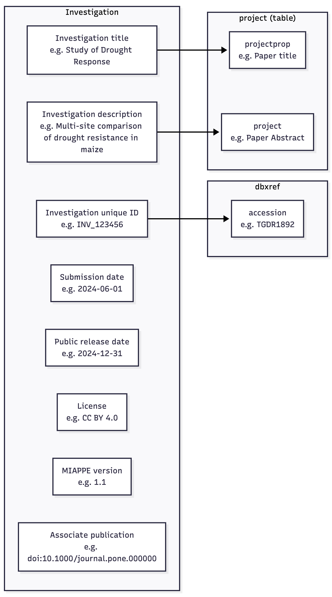

.. image:: ../_static/images/miappe_logo.png
   :alt: Description of your PNG
    
============================

The TreeGenes Plant Phenotype Submission (TPPS) system has been updated to support submissions that are compliant with the MIAPPE (Minimum Information About a Plant Phenotyping Experiment) standard. This document outlines the necessary steps and considerations for preparing and submitting MIAPPE-compliant data through TPPS. This documentation assumes that the reader is already familiar with the `MIAPPE`_ standard.

.. note::

    colors in flowchart correspond to requriements

Investigation
-------------

Investigations in MIAPPE correspond to TGDRxxxx studies in TPPS. Their use is intended to encapsulate large projects with their children studies. For example, a commond garden experiment may conduct multiple studies through time and report on the traits of progeny through successive years.  

.. _MIAPPE: https://www.miappe.org/

Study
-----

Information provided here describes the duration, location, experimental design, observation unit, and kind of growth facility leveraged in the study.  

