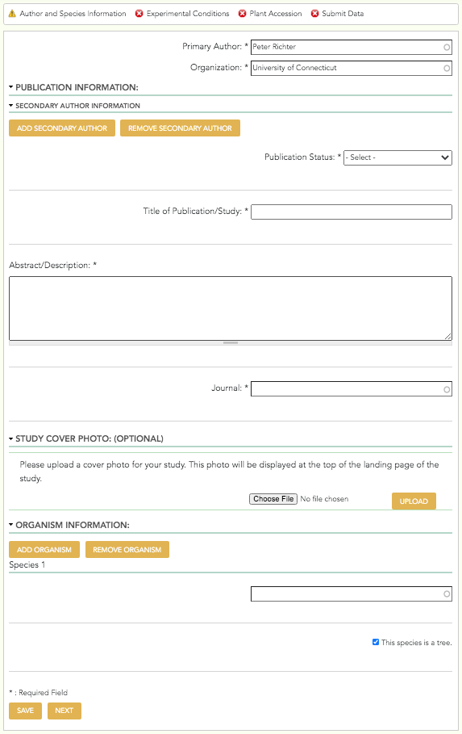

***********************
Publication and Species
***********************

The first set of fields is the Author and Species Information section. Here you will be asked to provide information about the publication, its authors, and the species studied.

User Information
================

* Primary Author: text field - The name of the first author of your publication. 
* Organization: text field - The name of the organization of the first author of your publication.

Publication
===========

* Secondary Authors: Select one of the following methods to provide information about secondary authors on the publication.

   * Textfields: click the 'Add Secondary Author' or 'Remove Secondary Author' buttons to add or remove secondary authors, respectively.
   * File: click the 'I have >30 Secondary Authors' checkbox to upload a file with all of your secondary authors - the file must have a column for each author's first name and last name. After you have uploaded your file, you will need to define the contents of the file. A table with the header 'Define Data' should appear, where you can select whether each column is 'First Name', 'Last Name', 'Middle Initial', or 'N/A'. If you do not define the columns that hold the first and last names of each author, you will not be able to continue.

* Publication Status: drop-down menu - The status of the publication in the publishing process: 'In Preparation or Submitted', 'In press', or 'Published'
* Publication Year: drop-down menu - The year the publication was published or submitted: years from 1990 to 2018
* Publication Title: text field - The title of the publication.
* Publication Abstract: text area - The abstract for the publication.
* Publication Journal: text field - The journal the publication was published in.

Tree Species
============

* Species **#**: text field - The genus and species of the species studied.
* Up to 5 species are allowed per submission

A screenshot of the Publication and Species page can be seen below:

