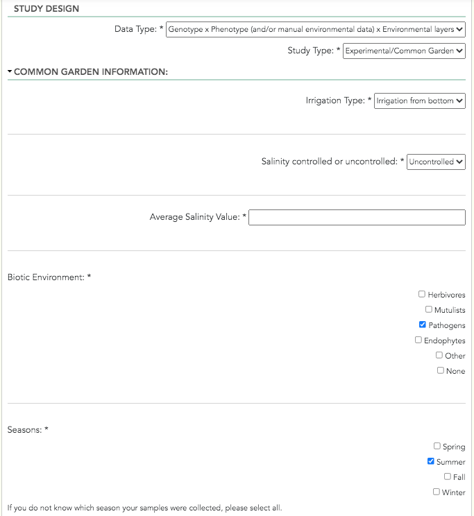

***********************
Experimental Conditions
***********************

The second set of fields in TPPS is the Study Design section. Here you will be asked to provide metadata about the study, such as when and where it took place, the type of data collected, and environmental factors.

Experiment Dates
================

* Start Date: two drop-down menus - The month and year that the experiment started
* End Date: two drop-down menus - The month and year that the experiment ended

Study Location
==============

* Coordinate Projection: drop-down menu - The coordinate projection of the GPS coordinates of the study location: 'WGS 84', 'NAD 83', 'ETRS 89', or 'Custom Location (street address)'
* Study Location: text field - The location of the study. If the coordinate projection is not a custom location, TPPS will parse and standardize the coordinates to be sent to the map. After you have provided the study location, you can click 'Click here to update map' to view the location of your study on Google Maps. This can be useful to verify that there is not a drastic error in the location.

Data Type
=========

* Data Type: drop-down menu - The type of data collected during the study: 'Genotype', 'Genotype x Environment', 'Phenotype x Environment', 'Genotype x Phenotype', 'Genotype x Phenotype x Environment'

Study Type
==========

* Study Type: drop-down menu - The type of study: 'Natural Population', 'Growth Chamber', 'Greenhouse', 'Common Garden', 'Plantation'

Environmental Metadata
======================

Natural Population
------------------

Natural Population fields are only visible when 'Natural Population' was selected from the 'Study Type' field.

* Season: checkboxes - The season(s) that the trees were assessed.
* Assessions: drop-down menu - The number of times, on average, the trees were assessed.

Growth Chamber
--------------

Growth Chamber fields are only visible when 'Growth Chamber' was selected from the 'Study Type' field.

* CO2 Control: drop-down menu - Whether the CO2 level was controlled during the study: 'controlled', 'uncontrolled'.
* CO2 Value: text field - The CO2 level during the study. If the level was not controlled, then provide the average CO2 level.
* Humidity Control: drop-down menu - Whether the Air Humidity was controlled during the study: 'controlled', 'uncontrolled'
* Humidity Value: text field - The Air Humidity during the study. If the level was not controlled, then provide the average Air Humidity.
* Light Intensity Control: drop-down menu - Whether the Light Intensity was controlled during the study: 'controlled', 'uncontrolled'
* Light Intensity: text field - The Light Intensity during the study. If the level was not controlled, then provide the average Light Intensity.
* Average High Temperature: text field - The average high temperature.
* Average Low Temperature: text field - The average low temperature.
* Rooting Type: drop-down menu - The type of rooting: 'Aeroponics', 'Hydroponics', 'Soil'
* Soil fields are only visible when 'Soil' was selected from the 'Rooting Type' field.

   * Soil Type: drop-down menu - The type of soil: 'Sand', 'Peat', 'Clay', 'Mixed', 'Other'
   * Custom Soil Type: text field - Define a custom soil type. Only visible when 'Other' was selected from the 'Soil Type' field.
   * Soil Container Type: text field - The type of container the soil was in.

* PH Control: drop-down menu - Whether the PH level was controlled during the study: 'controlled', 'uncontrolled'
* PH Value: text field - The PH level during the study. If the level was not controlled, then provide the average PH level.
* Treatments: checkboxes with textfields - The treatments the trees were subject to during the study. If a treatment is checked, a textfield for the description of that treatment will appear below it.

Greenhouse
----------

Greenhouse fields are only visible when 'Greenhouse' was selected from the 'Study Type' field.

* Humidity Control: drop-down menu - Whether the Air Humidity was controlled during the study: 'controlled', 'uncontrolled'
* Humidity Value: text field - The Air Humidity during the study. If the level was not controlled, then the Air Humidity is not required.
* Light Intensity Control: drop-down menu - Whether the Light Intensity was controlled during the study: 'controlled', 'uncontrolled'
* Light Intensity: text field - The Light Intensity during the study. If the level was not controlled, then the Light Intensity is not required.
* Average High Temperature: text field - The average high temperature.
* Average Low Temperature: text field - The average low temperature.
* Rooting Type: drop-down menu - The type of rooting: 'Aeroponics', 'Hydroponics', 'Soil'
* Soil fields are only visible when 'Soil' was selected from the 'Rooting Type' field.

   * Soil Type: drop-down menu - The type of soil: 'Sand', 'Peat', 'Clay', 'Mixed', 'Other'
   * Custom Soil Type: text field - Define a custom soil type. Only visible when 'Other' was selected from the 'Soil Type' field.
   * Soil Container Type: text field - The type of container the soil was in.

* PH Control: drop-down menu - Whether the PH level was controlled during the study: 'controlled', 'uncontrolled'
* PH Value: text field - The PH level during the study. If the level was not controlled, then the PH level is not required.
* Treatments: checkboxes with textfields - The treatments the trees were subject to during the study. If a treatment is checked, a textfield for the description of that treatment will appear below it.

Common Garden
-------------

Common Garden fields are only visible when 'Common Garden' was selected from the 'Study Type' field.

* Irrigation Type: drop-down menu - The type of irrigation: 'Irrigation from top', 'Irrigation from bottom', 'Drip Irrigation', 'Other', 'No Irrigation'
* Custom Irrigation Type: text field - Define a custom irrigation type. Only visible when 'Other' was selected from the 'Irrigation Type' field.
* Salinity Control: drop-down menu - Whether the Salinity level was controlled during the study: 'controlled', 'uncontrolled'
* Salinity Value: text field - The Salinity level during the study. If the level was not controlled, then provide the average Salinity level.
* Biotic Environment: drop-down menu - The type of biotic environment: 'Herbivores', 'Mutilists', 'Pathogens', 'Endophytes', 'Other', 'None'
* Custom Biotic Environment Type: text field - Define a custom biotic environment type. Only visible when 'Other' was selected from the 'Biotic Environment' field.
* Season: checkboxes - The season(s) that the trees were assessed.
* Treatments: checkboxes with textfields - The treatments the trees were subject to during the study. If a treatment is checked, a textfield for the description of that treatment will appear below it.

Plantation
----------

Plantation fields are only visible when 'Plantation' was selected from the 'Study Type' field.

* Season: checkboxes - The season(s) that the trees were assessed.
* Assessions: drop-down menu - The number of times, on average, the trees were assessed.
* Treatments: checkboxes with textfields - The treatments the trees were subject to during the study. If a treatment is checked, a textfield for the description of that treatment will appear below it.

A screenshot of the Experimental Conditions page can be seen below:

