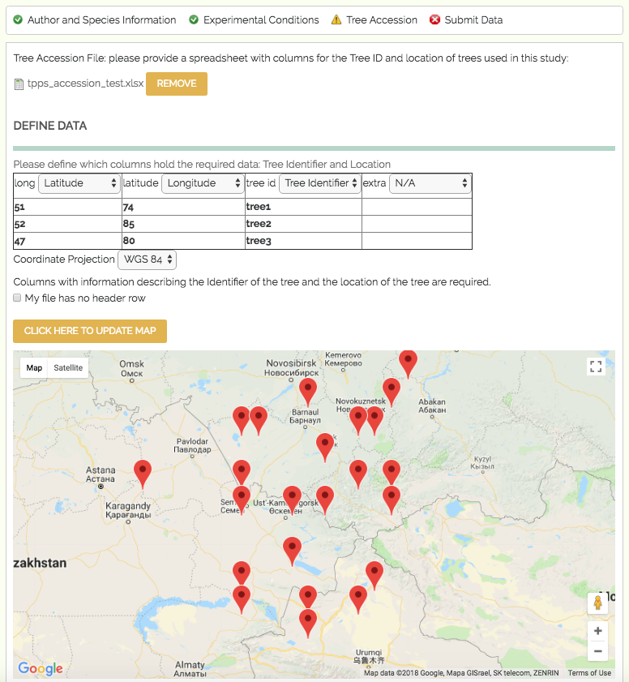

**************
Tree Accession
**************

The third set of fields in TPPS is the Tree Accession section. Here you will be asked to submit a file or files that describe each tree with a unique identifier and a geographic location.

* Tree Accession File: file upload - The tree accession file. This file must have at least a column for Tree ID, and columns describing the location of the trees. There are several options for the location column formats, including GPS coordinates and country/state/district. Files that include more than one species of tree will also need to provide columns for the genus and species of each tree. When the file is uploaded, you will need to define the contents of the file. A table with the header 'Define Data' should appear, where you can select which columns describe the required data. If you do not define the required columns, you will not be able to continue.
* Coordinate Projection: drop-down menu - The coordinate projection of coordinate locations in the tree accession file: 'WGS 84', 'NAD 83', 'ETRS 89'. This feature is currently only available for accession files with GPS coordinate locations.
* After uploading the tree accession file and selecting the correct coordinate projection, you can click the button 'Click here to update map' to view the locations of the trees you described on Google Maps. This can be useful to verify that there are no drastic errors in the locations. This feature is currently only available for accession files with GPS coordinate locations.

* Separate Tree Accession: checkbox - If you would like to upload a separate tree accession file for each species, click this checkbox. This field is only available for studies with more than one tree species.
* Separate Tree Accession Files: file uploads - The tree accession files. These fields are simply duplicates of the 'Tree Accession File' field above.

A screenshot of the Tree Accession page can be seen below:

