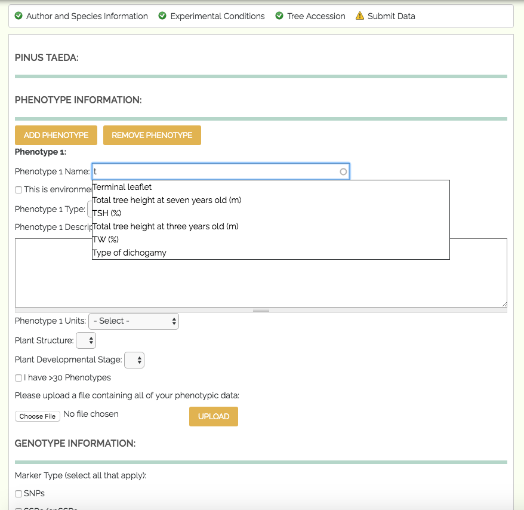

************************************
Genotype, Phenotype, and Environment
************************************

The fourth set of fields in TPPS is the Genotype, Phenotype, and Environment section. Here you will be asked to provide the data and metadata for your phenotypes and genotypes. If you are submitting a study with multiple species, and would like to use the same phenotype/genotype data across multiple species, you can select the ‘<Genotype/Phenotype> information for <organism i> is the same as <genotype/phenotype> information for <organism i-1>.’ box. Each of the fields on this page is asked once per tree species:

Phenotype
=========

Phenotype fields are only visible when 'Genotype x Phenotype', 'Genotype x Phenotype x Environment', or 'Phenotype x Environment' was selected from 'Data type' in `Study Design`_.

* Phenotype Metadata: select one or both of the following methods to provide phenotype metadata:

   * Textfields: click the 'Add Phenotype' or 'Remove Phenotype' buttons to add or remove phenotypes, respecitively. The following fields are required once per phenotype:

      * Phenotype Name: text field - The name of the phenotype.
      * Phenotype Attribute: text field - The attribute that the phenotype is describing. For example, "amount", "width", "mass", "age", "density", "color", "time" would be phenotype attributes.
      * Phenotype Description: text field - A brief description of the phenotype.
      * Phenotype Units: text field - The units of the phenotype. For example, "meters", "cm", "inches", "°C", "Degrees Fahrenheit" would be phenotype units.
      * Phenotype Structure: text field - The structure that the phenotype is describing. If your phenotype has a structure, you can click 'Phenotype has a structure descriptor' and provide a structure. Structure can refer to a tissue type or to a biological process.
      * Phenotype Value Range: text fields - A maximum and minimum value for the phenotype. If your phenotype is binary or has a range, you can click 'Phenotype has a value range' and provide a value range.

   * File: Click the 'I would like to upload a phenotype metadata file' checkbox to upload a phenotype file. You will be shown a table with several drop-down menus, along with the names of your column headers, and the first few rows of data in your file. You will then be asked to select what type of data each of your columns holds: 'Name/Identifier', 'Attribute', 'Description', 'Units', 'Structure', 'Minimum Value', 'Maximum Value', or 'N/A'. Columns marked 'N/A' will still be kept in the flat file, but will not be recorded in the database with the other data from the file. Columns that hold 'Name/Identifier', 'Attribute', 'Description', and 'Units' must be defined before continuing.

* Phenotype Data: file upload - The phenotype data. This file should contain the 'Tree Id' of the tree that the phenotype is describing, the 'Name/Identifier' of the phenotype, and the 'Value' that was actually measured for this phenotype.

Genotype
========

Genotype fields are only visible when 'Genotype', 'Genotype x Phenotype', 'Genotype x Environment', or 'Genotype x Phenotype x Environment' was selected from 'Data Type' in `Study Design`_.

* Genotype Marker Type: checkboxes - The types of genotype markers: 'SNPs', 'SSRs/cpSSRs', 'Other'. Select all that apply.
* SNPs Information fields are only visible and required when 'SNPs' was selected from 'Genotype Marker Type'.

   * Experimental Design: drop-down menu - The experimental design: 'GBS', 'Targeted Capture', 'Whole Genome Resequencing', 'RNA-Seq', 'Genotyping Array'
   * GBS Type: drop-down menu - The type of GBS experiment: 'RADSeq', 'ddRAD-Seq', 'NextRAD', 'RAPTURE', 'Other'. Only visible when 'GBS' was selected from the 'Experimental Design' field.
   * Custom GBS Type: text field - Define a custom GBS Type. Only visible when 'Other' was selected from the 'GBS Type' field.
   * Targeted Capture Type: drop-down menu - The type of Targeted Capture experiment: 'Exome Capture', 'Other'. Only visible when 'Targeted Capture' was selected from the 'Experimental Design' field.
   * Custom Targeted Capture Type: text field - Define a custom Targeted Capture type. Only visible when 'Other' was selected from the 'Targeted Capture Type' field.

* SSRs/cpSSRs Type: text field - The type of SSRs/cpSSRs marker. Only visisble when 'SSRs/cpSSRs' was selected from the 'Genotype Marker Type' field.
* Other Marker Type: text field - The type of genotype marker. Only visisble when 'Other' was selected from the 'Genotype Marker Type' field.
* Reference Genome/Assembly: drop-down menu - The reference genome/assembly: TPPS finds local reference genomes from the site it is installed on and their versions, and presents them as options in this drop-down. The other available options for a reference genome/assembly are: 'I can provide a URL to the website of my reference file(s)', 'I can provide a GenBank accession number (BioProject, WGS, TSA) and select assembly file(s) from a list', 'I can upload my own reference genome file', 'I can upload my own reference transcriptome file', 'I am unable to provide a reference assembly'.
* External Reference Genome/Assembly: Either upload or locate the genome/assembly file(s).

   * BioProject Accession number: text field - The NCBI accession number of the BioProject associated with this study. After this number has been provided, TPPS will search NCBI for assembly files that are linked to this BioProject number and present them to you, as well as links to view them individually on NCBI. You will need to select the assembly files that are relevant to this study. Only visible when 'I can provide a GenBank accession number (BioProject, WGS, TSA) and select assembly file(s) from a list' was selected from the 'Reference Genome/Assembly' field.
   * Load Reference from URL: For 'I can provide a URL to the website of my reference file(s)' option, you will be presented with a set of form fields based on the 'Tripal FASTA Loader'. You can skip the 'Existing File(s)' and 'You may select a file that is already uploaded' sections. You will just need to specify the remote path of the reference, the analysis type, and the sequence type. If you would like, you can also specify an external database where the sequences from your url have a cross-reference. If you do, you will also need to provide a regular expression for the accession number. External database cross-reference and accession number are not required.
   * Upload Reference manually: For the 'I can upload my own reference genome file', or 'I can upload my own reference transcriptome file' options, you will be presented with a set of form fields based on the 'Tripal FASTA Loader'. You only need to supply a file from the 'Existing File(s)' **or** the 'You may select a file that is already uploaded' section. You can skip the 'Remote path' section. You will need to specify the assembly type and sequence type. External database for cross-reference and regular expression for external database accession number are optional.

* Genotype File Types: checkboxes - 'Genotype Spreadsheet/Assay', 'Assay Design', 'VCF'. Select all that apply. 'Assay Design' is only visible when 'SNPs' was selected from the 'Genotype Marker Type' field.
* Genotype Spreadsheet/Assay File: file upload - The genotype assay file. You will be required to specify which of your columns holds the Tree ID and genotype data in each row of your file. Only visible when 'Genotype Spreadsheet/Assay' was selected from the 'Genotype File Types' field.
* Assay Design File: file upload - The assay design file. Only visible when 'Assay Design' was selected from the 'Genotype File Types' field.
* VCF File: file upload - The VCF file. Only visible when 'VCF' was selected from the 'Genotype File Types' field.

.. _`Study Design`: page_2.html

