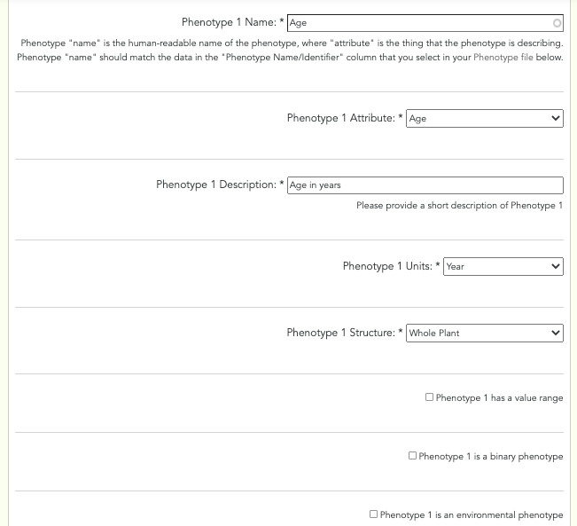
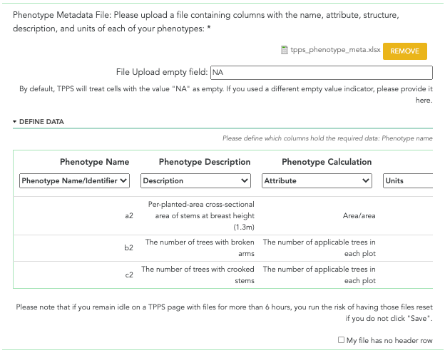

************************************
Genotype, Phenotype, and Environment
************************************

The fourth set of fields in TPPS is the Genotype, Phenotype, and Environment section. Here you will be asked to provide the data and metadata for your phenotypes and genotypes. If you are submitting a study with multiple species, and would like to use the same phenotype/genotype data across multiple species, you can select the ‘<Genotype/Phenotype> information for <organism i> is the same as <genotype/phenotype> information for <organism i-1>.’ box. Each of the fields on this page is asked once per species:

Phenotype
=========

* Phenotype Metadata: select one or both of the following methods to provide phenotype metadata:

   * Textfields: click the 'Add Phenotype' or 'Remove Phenotype' buttons to add or remove phenotypes, respecitively. The following fields are required once per phenotype:

      * Phenotype Name: text field - The name of the phenotype.
      * Phenotype Attribute: drop-down menu - The attribute that the phenotype is describing.
      * Phenotype Custom Attribute: textfield - Custom attribute that was not in the default list.
      * Phenotype Description: text field - A brief description of the phenotype.
      * Phenotype Units: text field - The units of the phenotype. For example, "meters", "cm", "inches", "°C", "Degrees Fahrenheit" would be phenotype units.
      * Phenotype Structure: text field - The structure that the phenotype is describing. Structure can refer to a tissue type or to a biological process. Default is 'Whole plant'.
      * Phenotype Custom Structure: textfield - Custom structure that was not in the default list.
      * Phenotype Value Range: text fields - A maximum and minimum value for the phenotype. If your phenotype is binary or has a range, you can click 'Phenotype has a value range' and provide a value range.
      * Phenotype is an environmental phenotype: checkbox - Check this box to indicate which phenotypes are environmental.

   * File: Click the 'I would like to upload a phenotype metadata file' checkbox to upload a phenotype file. You will be shown a table with several drop-down menus, along with the names of your column headers, and the first few rows of data in your file. You will then be asked to select what type of data each of your columns holds: 'Name/Identifier', 'Attribute', 'Description', 'Units', 'Structure', 'Minimum Value', 'Maximum Value', or 'N/A'. Columns marked 'N/A' will still be kept in the flat file, but will not be recorded in the database with the other data from the file. Columns that hold 'Name/Identifier', 'Attribute', 'Description', 'Units', and 'Structure' must be defined before continuing.

* Phenotype Data: file upload - The phenotype data. This file should contain the 'Plant Id' of the plant that the phenotype is describing, the 'Name/Identifier' of the phenotype, and the 'Value' that was actually measured for this phenotype.

A screenshot of the manual phenotype information fields can be seen below:

A screenshot of the phenotype metadata file field can be seen below:

A screenshot of the phenotype data file field can be seen below:

.. image:: ../../../images/TPPS_phenotype_data.png

Genotype
========

* Genotype Marker Type: checkboxes - The types of genotype markers: 'SNPs', 'SSRs/cpSSRs', 'Indels', 'Other'. Select all that apply.
* SNPs Information fields are only visible and required when 'SNPs' was selected from 'Genotype Marker Type'.

   * Experimental Design: drop-down menu - The experimental design: 'GBS', 'Targeted Capture', 'Whole Genome Resequencing', 'RNA-Seq', 'Genotyping Array'
   * GBS Type: drop-down menu - The type of GBS experiment: 'RADSeq', 'ddRAD-Seq', 'NextRAD', 'RAPTURE', 'Other'. Only visible when 'GBS' was selected from the 'Experimental Design' field.
   * Custom GBS Type: text field - Define a custom GBS Type. Only visible when 'Other' was selected from the 'GBS Type' field.
   * Targeted Capture Type: drop-down menu - The type of Targeted Capture experiment: 'Exome Capture', 'Other'. Only visible when 'Targeted Capture' was selected from the 'Experimental Design' field.
   * Custom Targeted Capture Type: text field - Define a custom Targeted Capture type. Only visible when 'Other' was selected from the 'Targeted Capture Type' field.

* SSRs/cpSSRs Type: text field - The type of SSRs/cpSSRs marker. Only visisble when 'SSRs/cpSSRs' was selected from the 'Genotype Marker Type' field.
* Other Marker Type: text field - The type of genotype marker. Only visisble when 'Other' was selected from the 'Genotype Marker Type' field.

A screenshot of the genotype marker type fields can be seen below:

.. image:: ../../../images/TPPS_genotype_marker.png

* Reference Genome/Assembly: drop-down menu - The reference genome/assembly: TPPS finds local reference genomes from the site it is installed on and their versions, and presents them as options in this drop-down. The other available options for a reference genome/assembly are: 'I can provide a URL to the website of my reference file(s)', 'I can provide a GenBank accession number (BioProject, WGS, TSA) and select assembly file(s) from a list', 'I can upload my own reference genome file', 'I can upload my own reference transcriptome file', 'I am unable to provide a reference assembly'.
* External Reference Genome/Assembly: Either upload or locate the genome/assembly file(s).

   * BioProject Accession number: text field - The NCBI accession number of the BioProject associated with this study. After this number has been provided, TPPS will search NCBI for assembly files that are linked to this BioProject number and present them to you, as well as links to view them individually on NCBI. You will need to select the assembly files that are relevant to this study. Only visible when 'I can provide a GenBank accession number (BioProject, WGS, TSA) and select assembly file(s) from a list' was selected from the 'Reference Genome/Assembly' field.
   * Load Reference from URL: For 'I can provide a URL to the website of my reference file(s)' option, you will be presented with a set of form fields based on the 'Tripal FASTA Loader'. You can skip the 'Existing File(s)' and 'You may select a file that is already uploaded' sections. You will just need to specify the remote path of the reference, the analysis type, and the sequence type. If you would like, you can also specify an external database where the sequences from your url have a cross-reference. If you do, you will also need to provide a regular expression for the accession number. External database cross-reference and accession number are not required.
   * Upload Reference manually: For the 'I can upload my own reference genome file', or 'I can upload my own reference transcriptome file' options, you will be presented with a set of form fields based on the 'Tripal FASTA Loader'. You only need to supply a file from the 'Existing File(s)' **or** the 'You may select a file that is already uploaded' section. You can skip the 'Remote path' section. You will need to specify the assembly type and sequence type. External database for cross-reference and regular expression for external database accession number are optional.

A screenshot of the genotype reference fields can be seen below:

.. image:: ../../../images/TPPS_genotype_ref.png

* Ploidy: drop-down menu - Only visible when 'SSRs/cpSSRs Genotype Spreadsheet' is selected from 'Genotype File Types'
* Genotype File Types: checkboxes - 'SNPs Genotype Assay', 'Assay Design', 'SNPs Associations', 'SSRs/cpSSRs Genotype Spreadsheet', 'Indel Genotype Spreadsheet', 'Other Marker Genotype Spreadsheet', 'VCF'. Select all that apply. 'SNPs Genotype Assay', 'SSRs/cpSSRs Genotype Spreadsheet', 'Indel Genotype Spreadsheet', 'Other Marker Genotype Spreadsheet' are only available when 'SNPs', 'SSRs/cpSSRs', 'Indels', 'Other' are selected from the 'Genotype Marker Type' field, respectively. 'Assay Design' and 'SNPs Associations' are only available if 'SNPs Genotype Assay' is selected.
* SNPs Genotype Assay File: file upload - The SNPs genotype assay file. The format of this file is very important! The first column should contain plant identifiers which match the plant identifiers provided in the accession file and all of the remaining columns should contain SNP data.
* Assay Design File: file upload - design file for SNPs genotype assay.
* SNPs Associations File: file upload - Spreadsheet containing SNPs Association data. You will be required to specify which of your columns holds the SNP ID, scaffold, position, allele, associated trait, and confidence value.

    * Confidence Value Type: drop-down menu - The type of confidence value, such as P-value, Genomic Inflation Factor, etc.
    * Association Analysis Tool: drop-down menu - Select analysis tool from list of options.
    * SNPs Population Structure file: optional file upload.
    * SNPs Kinship File: optional file upload.

* SSRs/cpSSRs Spreadsheet: file upload - SSRs/cpSSRs genotype file. The format of this file is very important! The first column should contain plant identifiers and each remaining column will be SSR/cpSSR data. The exact format depends on the ploidy selected.

    * Extra SSRs/cpSSRs Spreadsheet: checkbox - Check this box to add an additional SSRs/cpSSRs file.
    * Additional SSRs/cpSSRs Type: textfield - Marker type of the additional SSRs/cpSSRs marker.
    * Additional SSRs/cpSSRs Ploidy: Ploidy of the additional SSRs/cpSSRs marker.
    * SSRs/cpSSRs Additional Spreadsheet: file upload - Additional SSRs/cpSSRs spreadsheet. Same format as the first SSRs/cpSSRs spreadsheet.

* Indel Genotype Spreadsheet: file upload - Indel genotype spreadsheet. The format of this file is very important! The first column should contain plant identifiers and all remaining columns should contain indel data.
* Other Marker Genotype Spreadsheet: file upload - Other marker genotype spreadsheet.
* VCF File: file upload - The VCF file. Must be a .zip file.

A screenshot of the genotype file fields can be seen below:

.. image:: ../../../images/TPPS_genotype_file.png

Environment
===========

* Use CartograPlant Layers: If CartograPlant Layers were enabled by your site administrator, you should have the option to use Environmental Layers provided by CartograPlant that you used in your study.
* CartograPlant Environmental Layers: checkboxes - All available CartograPlant Environmental Layers. From here you can view the names and descriptions of each CartograPlant Environmental layer you have to choose from.
* CartograPlant Environmental Layer Parameters: checkboxes - If you selected some CartograPlant Environmental Layers, you will need to indicate which variables from the layer you used in your study. Parameter fields will only be visible for layers that you selected.
* Custom Environmental Layer: checkbox - Non-CartograPlant environmental layer. Specify the database URL, the name of the layer, and the parameters used.

